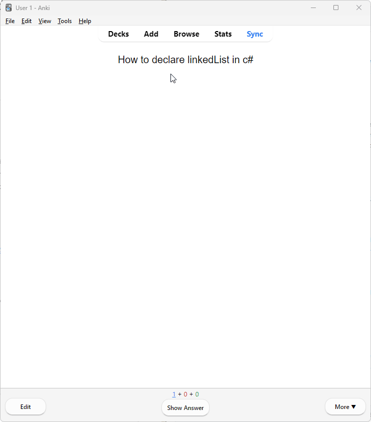

# 🧠 CS Custom Flashcards for Anki

This is a custom Anki note type built to help with studying **Computer Science** concepts. It's designed for clean formatting and interactive study with **code snippets**, **images**, and **toggle buttons**.

## ✨ Features

- 📌 Centered question and answer formatting
- 🧩 Toggle button for **code blocks** – only shows if there's code
- 🖼️ Toggle for **images** – only shows if there's an image
- 🎯 Code block is left-aligned and uses monospace font (16px)
- Clean and minimal design

## 📥 How to Use

1. Download the [CS_Custom_Flashcards.apkg](./CS_Custom_Flashcards.apkg) file from this repo
2. Open **Anki**
3. Go to **File > Import**
4. Select the `.apkg` file you downloaded
5. The deck and its custom note type will be added to your Anki
6. Start studying or customize the note further!

## 📸 Preview

## 🛠 Fields Used

- `Question`
- `Answer`
- `Code` (optional – shows button only if filled)
- `Image` (optional – shows button only if filled)

